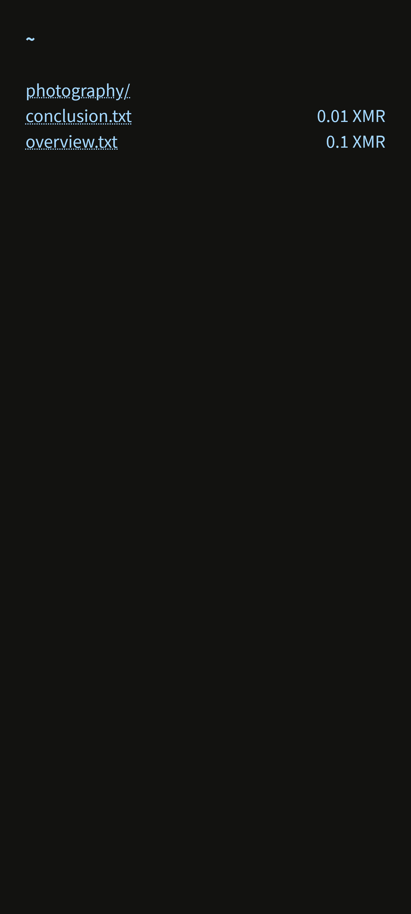
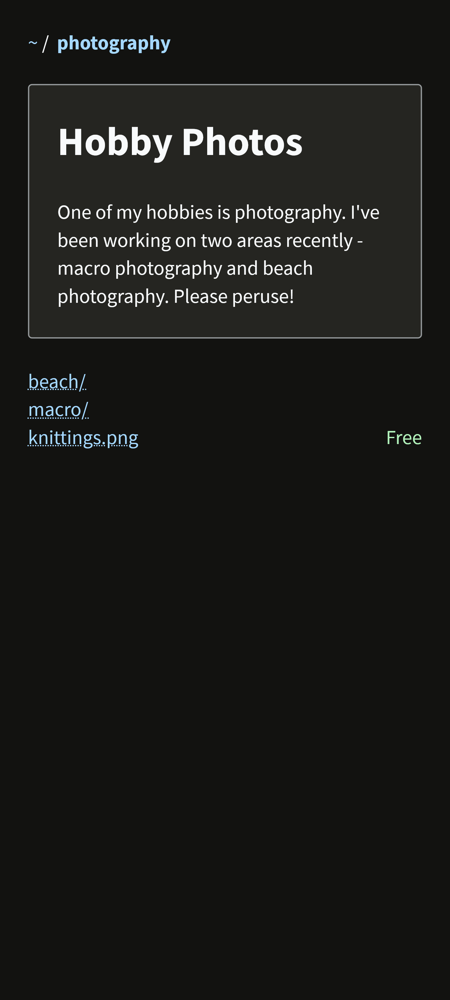
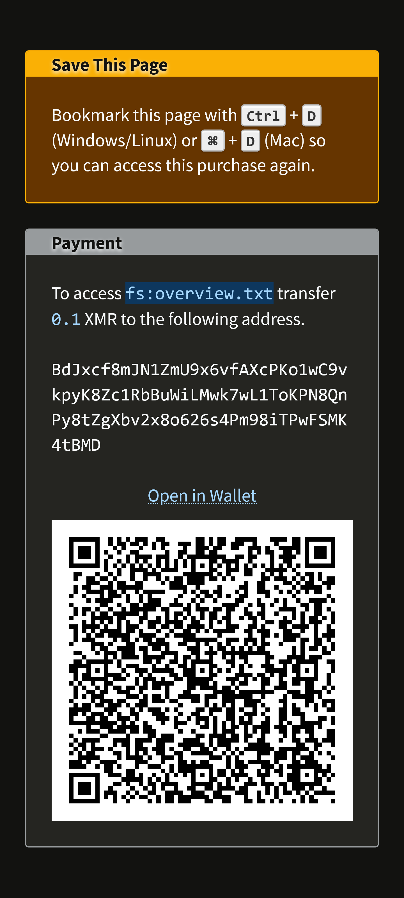
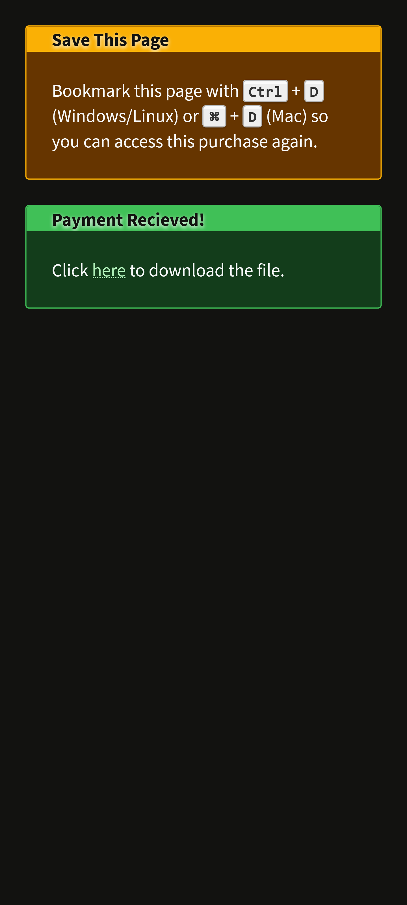

#   Dosiero

A minimalist  *stateless* self-hosted *no-js* pay-to-access file server with Monero payments, designed to be easily extensible.

   

## Usage

Download one of the pre-built binaries, or clone the repository and run the following command:

```sh
dotnet publish ./src/Dosiero --output build --self-contained
```

Then in the `build` folder there will be a `dosiero` executable. Before running you must configure
the `appsettings.json` file that is in the same directory to suit your needs. Here is an example configuration:

```json
{
  "Dosiero": {
    "ConfigFolder": "C:\\Users\\Henry\\Documents\\store"
  },
  "FsFileProvider": {
    "Path": "C:\\Users\\Henry\\Documents\\store"
  },
  "MoneroPayment": {
    "WalletRpcUri": "https://127.0.0.1:28089"
  }
}
```

|Section|Setting|Description|Required|
|--|--|--|--|
|Dosiero|ConfigFolder|The path within with to search for `*.dosiero` files which are used to configure prices and descriptions for files.|Y|
|FsFileProvider|Path|The path from which to make files available for download.|Y|
|MoneroPayment|WalletRpcUri|The URI of the wallet RPC server which should accept payments.|Y|
|MoneroPayment|WalletRpcUsername|The username to login to the RPC server with.|N|
|MoneroPayment|WalletRpcPassword|The password to login to the RPC server with.|N|
|MoneroPayment|AcceptSelfSignedCerts|Whether self-signed certificates should be accepted (defaults to Y).|N|

Within your `ConfigFolder` you can create as many `*.doserio` files as you like. The syntax of the config files is as follows:

```
---
<glob-pattern>[ = <price>]
---
[<html>]
```

_Note: `<glob-pattern>` is a standard glob pattern, but to match with a directory you must include a trailing `/`._

For example, to make all songs 0.01 XMR, but include custom covers for each album you could have the following files:

**.doserio:**
```
---
albums/ = 0.01
---
```

**_album1.dosiero:**
```
---
albums/album_1/
---

<h1>Album 1</h1>

This is a great album, our first one in-fact!
```

**_album2.dosiero:**
```
---
albums/album_2/ = 0.05
---

<h1>Album 2</h1>

This album is so great we've hiked the prices. Hope you don't mind.
```
